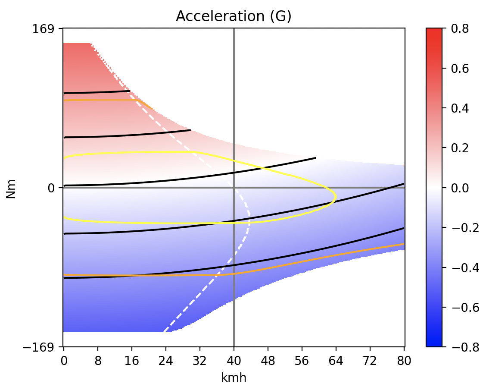

pypowertrain
=========

[Get started with a runnnable notebook!](https://mybinder.org/v2/gh/EelcoHoogendoorn/pypowertrain/HEAD?labpath=getting_started.ipynb)

Summary
-------
This package implements functionality for the simulation and optimization of electric powertrains with field-oriented controllers. It seeks to be a repository of well-characterized components, making their performance easy to evaluate in combination.

```python
def test_example(kmh=40, inch=20):
	"""Simple minimal example"""
	bike = BikeSystem(
		load=BikeLoad(
			CdA=0.7 * 0.8,
			Cr=0.004,
			structure_weight=40,
			rider_weight=80,
			nominal_kmh=kmh,
			wheel_diameter=inch * 25.4e-3,
			front=True, rear=True,
		),
		actuator=Actuator(
			motor=grin.all_axle(turns=8),
			controller=odrive.pro(),
		),
		battery=define_battery_limits(v=58, wh=500),
	)

	system_plot(bike)
```


This package has functionality for [optimizing](./pypowertrain/test/test_optimize.py) over all components of a powertrain, such as motor geometry, battery configuration or controller parameters, to attain certain design constraints, while minimizing objectives such as weight or cost. Currently the only physical systems implemented are vehicles, but it is designed to be easy to extend to robotic actuators, quadcopters, wind turbines, or you name it.

The approach to motor design optimization relies on applying simple scaling laws to existing, empirically verified components. Doing ab-initio calculations has its use; but does not easily answer question like 'can the manufacturer actually wind these wires in that tooth geometry' and 'is the saturation going to cause audible harmonics that cross into the annoying-region'; and so on. 

There are some simple scaling laws that can inform us of what ought to be possible. The simplest example is rewinding with a different number of turns, but a number of dependable scaling laws are known. With only tweaks to a few such parameters, you can cover a very large part of design space, starting from a few empirically well characterized components. The current implementation of motor dimensional scaling uses [this paper](https://www.researchgate.net/publication/283646083_Scaling_laws_for_synchronous_permanent_magnet_machines) as a starting point.

This library is inspired by grins' [motor simulator](https://ebikes.ca/tools/simulator.html), with the main difference being that this is a modular programmable open source library, with somewhat more general aims. For equal inputs, our results are [almost-but-not-quite](./pypowertrain/bike/test/test_grin.py) the same those of the above simulator. If you can help us narrow down the gap, contributions are welcome! 

What would also be highly appreciated are other empirical test cases of whole powertrains with known components, that the resuts of pypowertrain can be compared to.